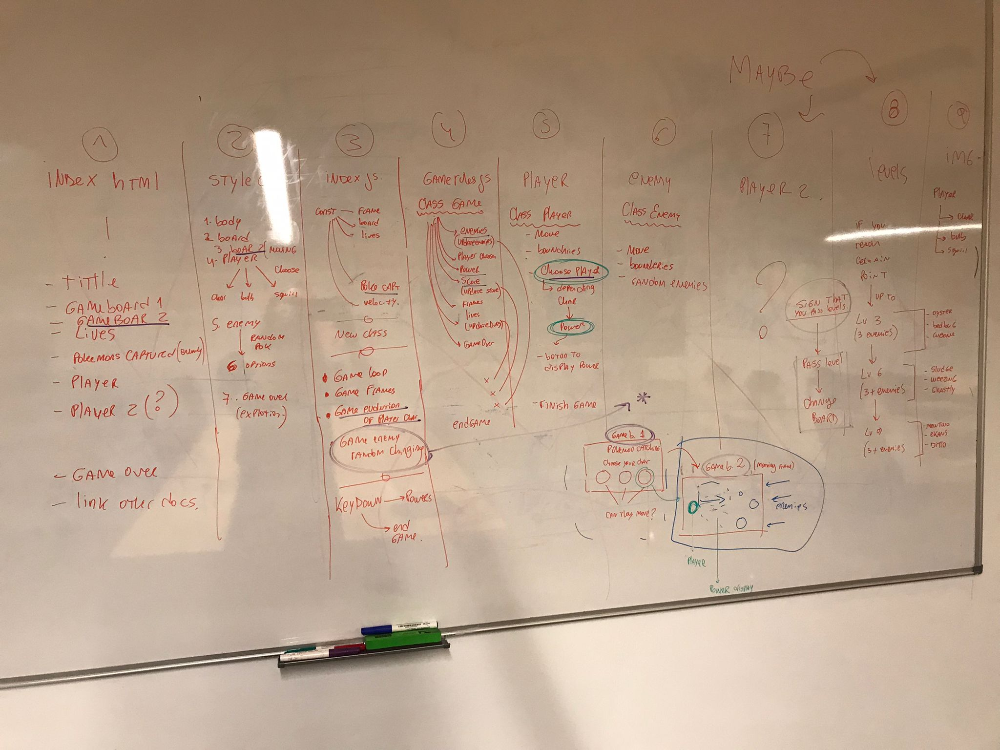
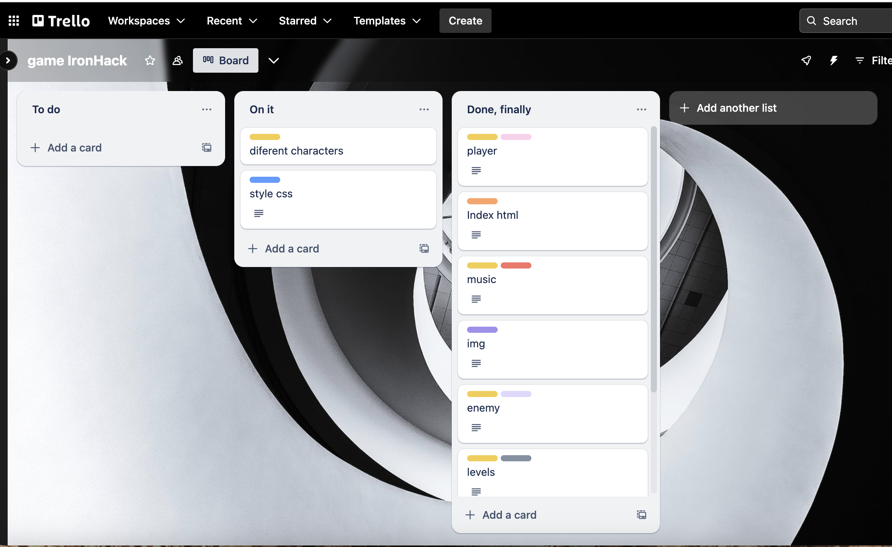

# TITTLE
POKEMON TRACKING GAME

## DESCRIPTION
Pokemon tracking is about chasing the maximun quantity of pokemons before the enemies kill you. To start with, you'll be able to choose between three players, each of them have a different power. When the game starts you will have 3 lives, use them wisely! There are three diferent levels, when you pass a level the enemies start coming faster! Use your arrows to move your player and the space bar to use your power for killing them and hunt them. You have to chase them all!

## STACK
- JavaScript
- HTML
- CSS

The approach for this game is to use classes, orient the code to objects, use arrays, forloops, if statements, OPP.

## MVP
- have a start board
- have a main game board
- have a catching score
- have lives
- use power to kill enemies
- use music

## BACKLOG
- add different quind of enemies not only one, with different velocities
- add more levels and with them, different cackground
- select your character at the beginning (3 options)

## PROJECT PLANNING
My project was divided in smaller tasks. I used Trello to organize  my tasks and to keep track of my progress. I also used the class board to have better idea of how my game would look like.

LINK OF THE PUBLISHED GAME: https://barbaralan.github.io/pokemon-tracking-game/

LINK OF THE SLIDES FOR THE PRESENTATION: https://www.canva.com/design/DAF7iIjmi5A/rvXt8Q8oS0ekFxeW1PkhJw/edit
